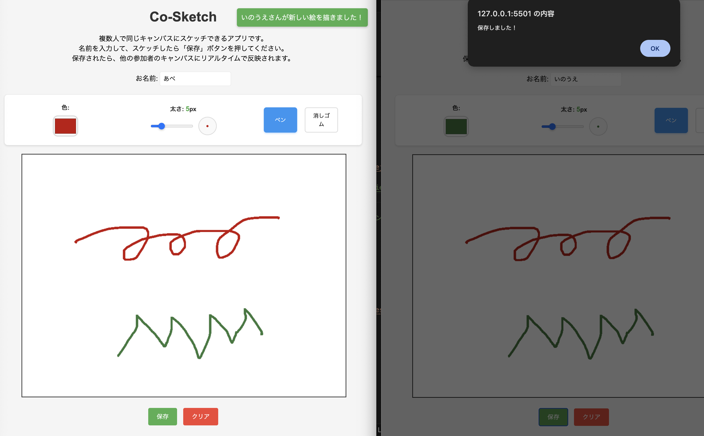
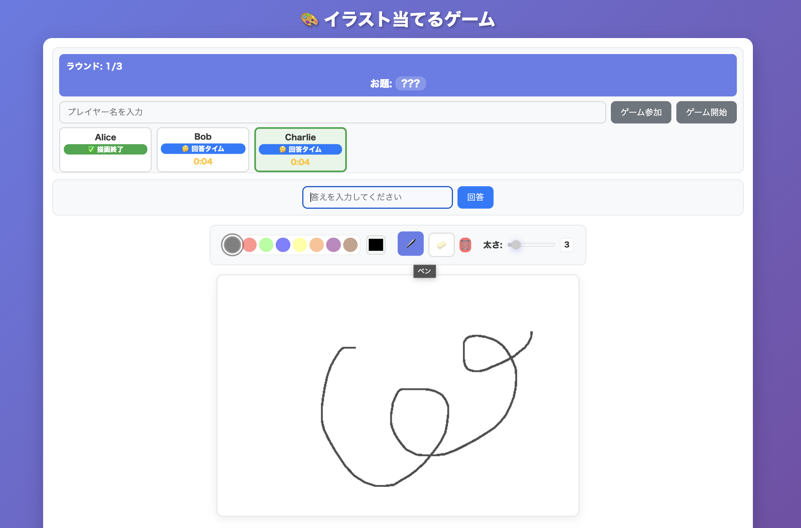

## 課題 No.04 チャットアプリ（Firebase）

## タイトル

Co-Sketch

## 概要

複数人で同じキャンバスにスケッチできるアプリです。

## 今回の課題のテーマ

- Firebase のリアルタイム通信を活かしたアプリを制作する

## 工夫した点

- スケッチを保存したら参加者全員のキャンバスにリアルタイムに反映されるようにした。
- Canvas API を使う場合、jQuery で実装できない機能があるため、全体的に jQuery を使用しないで実装した。

## 難しかった点、課題

- 当初は、複数人の参加者が 1 つのお題に対してイラストを描き、他の人がそのお題を当てるイラスト当てアプリを目指していた。ローカル環境で画面のイメージやクイズ機能の一部を実装できたが、Firebase を用いてインターネット上で動作させるにはリアルタイムでの描画共有や、描く人と答える人のセッション管理の実装が必要と分かり、取り組んでみたものの難易度が高く提出に間に合わず前日に断念。まずは Firebase への接続確認やデータ登録から作成するべきだったと反省した。

- セッション管理やリアルタイム描画の同期処理は、アプリを実現するうえで欠かせない重要な機能・知識だと感じたため、今後再チャレンジしたい。

## 画面イメージ

### Co-Sketch

### Sketch Quiz（当初作成したかったアプリの画面イメージ）

